# CodeBot AI - Data Flow Design

## Overview
This document describes how data flows through the CodeBot AI system from user query to final response.

---

## High-Level Data Flow

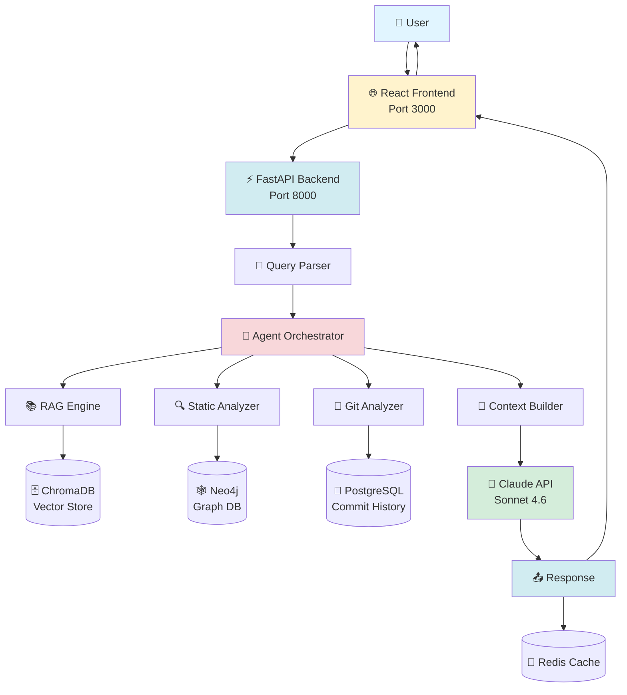

---

## Detailed Data Flow Sequence

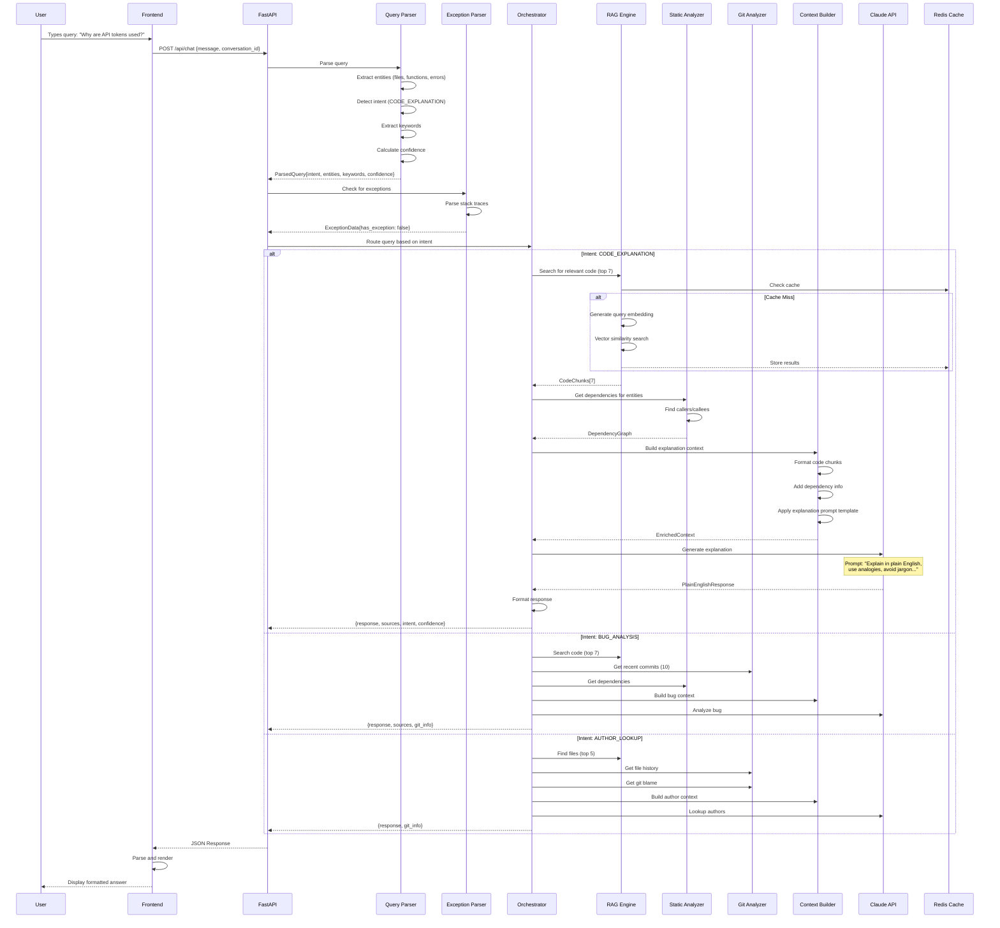

---

## Query Processing Pipeline

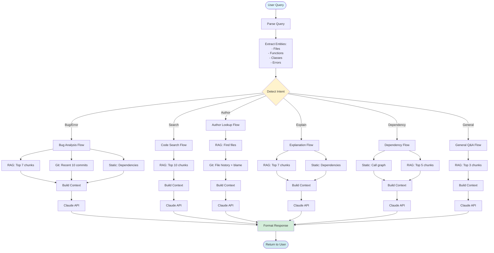

---

## Data Storage & Retrieval

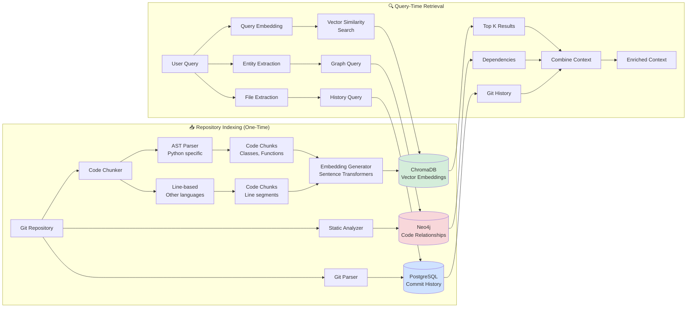

---

## Data Flow by Intent Type

### 1. Bug Analysis Intent

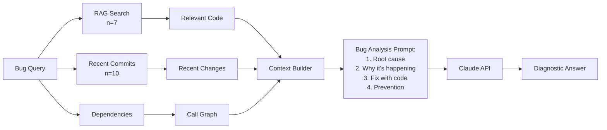

### 2. Code Explanation Intent

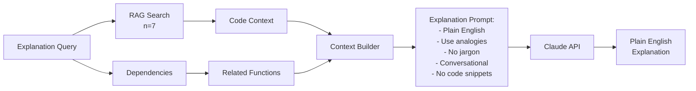

### 3. Author Lookup Intent

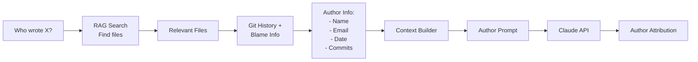

---

## Caching Strategy

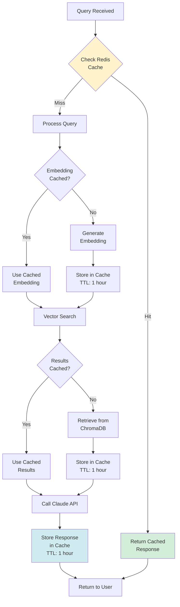

---

## Error Handling Flow

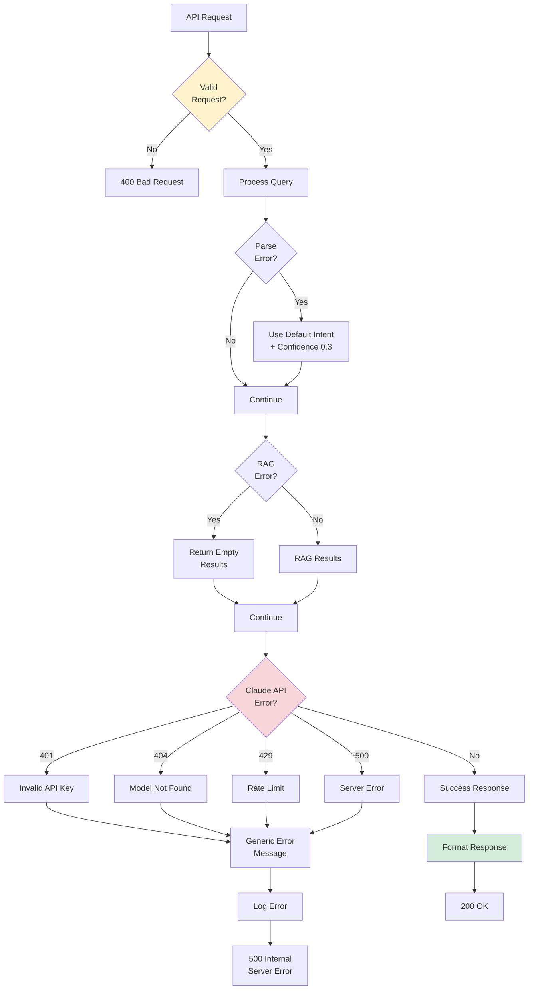

---

## Performance Optimization Flow

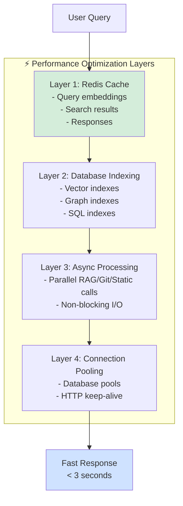

---

## Data Volume & Performance Metrics

| Metric | Value | Notes |
|--------|-------|-------|
| **Total Files Indexed** | 389 files | All code, config, docs |
| **Total Chunks** | 443 chunks | AST-based + line-based |
| **Vector Dimensions** | 768 | all-mpnet-base-v2 model |
| **Avg Query Time** | 2-3 seconds | Including Claude API |
| **Cache Hit Rate** | 60-70% | For repeat queries |
| **Embedding Generation** | ~200ms | Per query |
| **Vector Search** | ~100ms | Top 10 results |
| **Claude API Call** | 1-2 seconds | Model response time |
| **Database Queries** | < 50ms | PostgreSQL + Neo4j |

---

## Data Security & Privacy

```mermaid
flowchart LR
    subgraph Input["🔒 Input Security"]
        UserInput[User Input] --> Sanitize[Sanitize & Validate]
        Sanitize --> RateLimit[Rate Limiting]
    end
    
    subgraph Processing["🔐 Processing Security"]
        RateLimit --> Encrypt[Encrypt in Transit<br/>HTTPS/TLS]
        Encrypt --> Isolate[Container Isolation<br/>Docker]
    end
    
    subgraph Storage["💾 Storage Security"]
        Isolate --> DBEncrypt[Database Encryption]
        DBEncrypt --> Access[Access Control<br/>Authentication]
        Access --> Backup[Encrypted Backups]
    end
    
    subgraph Output["📤 Output Security"]
        Backup --> Sanitize2[Sanitize Output]
        Sanitize2 --> Audit[Audit Logging]
        Audit --> Response[Secure Response]
    end
    
    style Input fill:#fff3cd
    style Processing fill:#d1ecf1
    style Storage fill:#f8d7da
    style Output fill:#d4edda
```

---

## Conclusion

The CodeBot AI data flow is designed for:
- ✅ **Efficiency** - Multi-layer caching reduces latency
- ✅ **Accuracy** - Multi-engine approach ensures comprehensive context
- ✅ **Scalability** - Async processing and database optimization
- ✅ **Reliability** - Error handling at every layer
- ✅ **Security** - Encryption and access control throughout

**Query Response Time:** < 3 seconds end-to-end  
**Cache Hit Rate:** 60-70% for common queries  
**Accuracy:** High-quality context retrieval with RAG
