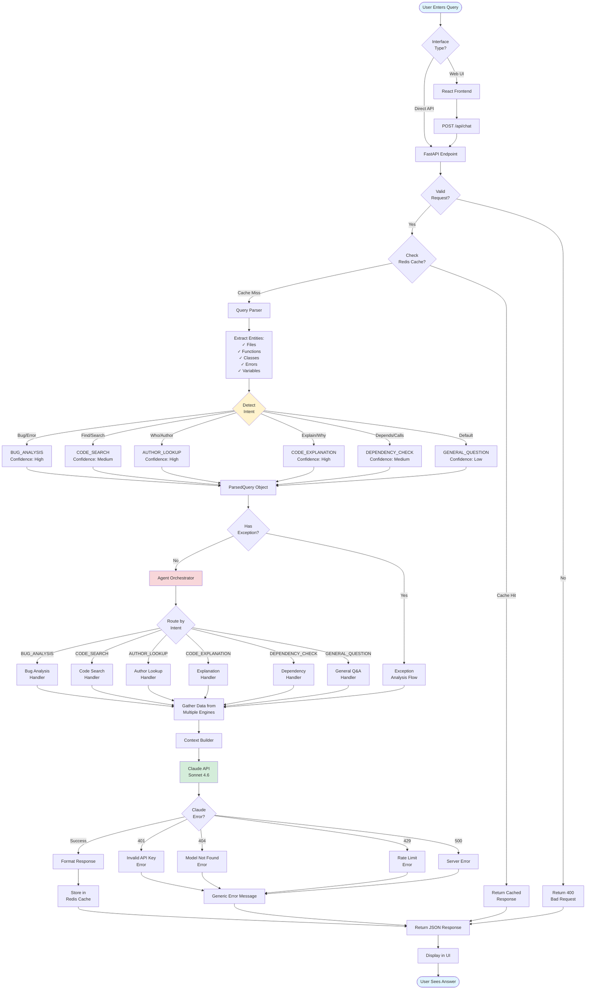
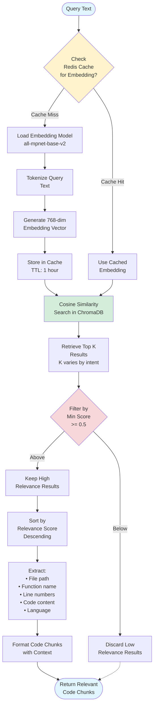
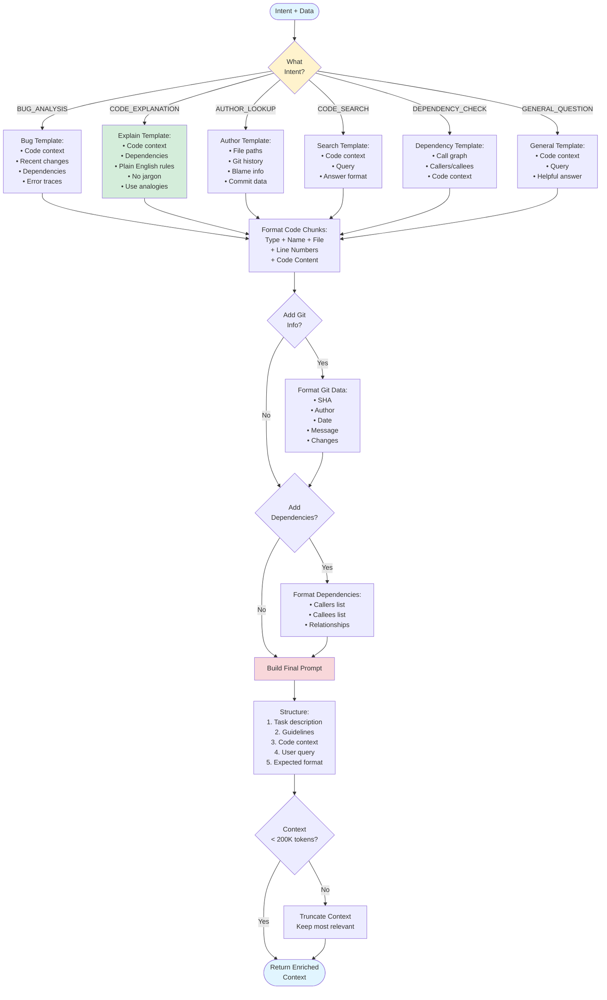
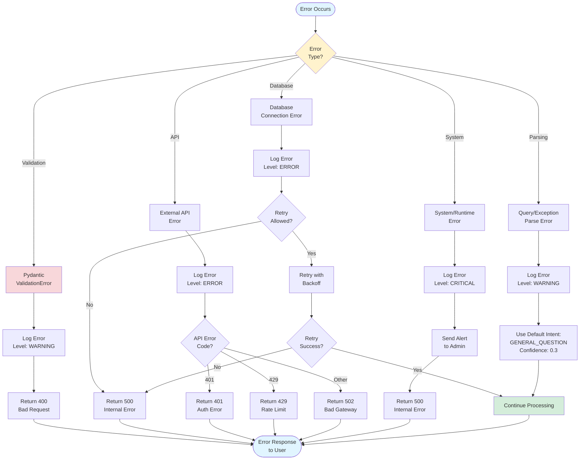
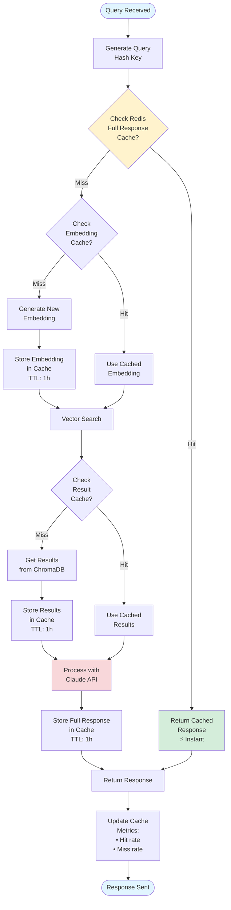
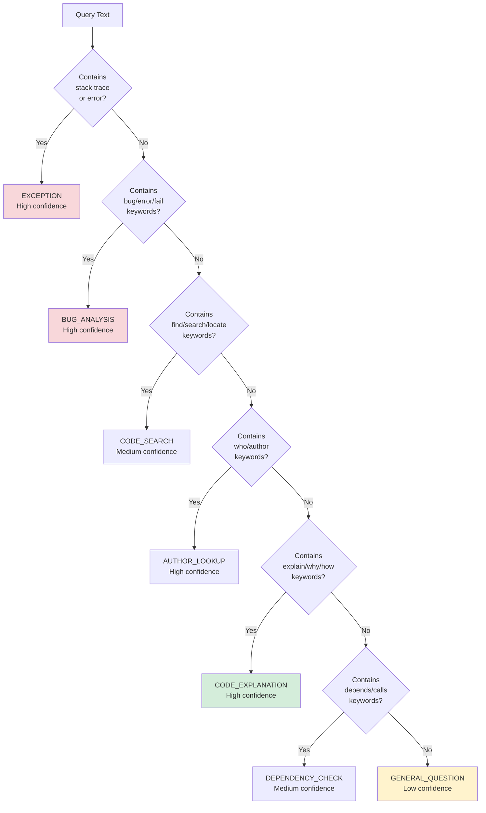

# CodeBot AI - Complete Flowchart

## System Flowchart Overview

This document provides comprehensive flowcharts for all major processes in CodeBot AI.

---

## 1. Complete User Query Flow



---

## 2. Repository Indexing Flow

```mermaid
flowchart TD
    Start([Trigger Indexing]) --> CheckRepo{Repository<br/>Exists?}
    
    CheckRepo -->|No| CloneRepo[Clone Repository<br/>from Git URL]
    CheckRepo -->|Yes| PullChanges[Pull Latest<br/>Changes]
    
    CloneRepo --> ScanFiles[Scan Repository<br/>Files]
    PullChanges --> ScanFiles
    
    ScanFiles --> FilterFiles{Filter Files}
    
    FilterFiles -->|Exclude| SkipFiles[Skip:<br/>✗ node_modules<br/>✗ __pycache__<br/>✗ .git<br/>✗ venv<br/>✗ dist/build<br/>✗ Binary files]
    
    FilterFiles -->|Include| ProcessFiles[Process Files:<br/>✓ .py, .java, .js<br/>✓ .ts, .go, .rs<br/>✓ .json, .yaml<br/>✓ .md, .txt<br/>✓ 30+ types]
    
    ProcessFiles --> DetectLang{Detect<br/>Language}
    
    DetectLang -->|Python| PythonChunker[Python Chunker<br/>AST-Based Parsing]
    DetectLang -->|Other| GenericChunker[Generic Chunker<br/>Line-Based Chunking]
    
    PythonChunker --> ExtractPython[Extract:<br/>• Classes<br/>• Functions<br/>• Methods<br/>• Imports<br/>• Docstrings]
    
    GenericChunker --> SplitLines[Split into Chunks:<br/>• Size: 1000 lines<br/>• Overlap: 200 lines]
    
    ExtractPython --> CreateChunks[Create Code Chunks]
    SplitLines --> CreateChunks
    
    CreateChunks --> GenerateID[Generate Unique<br/>Chunk ID<br/>MD5 Hash]
    
    GenerateID --> GenerateEmbed[Generate Embedding<br/>all-mpnet-base-v2<br/>768 dimensions]
    
    GenerateEmbed --> StoreChroma[Store in ChromaDB:<br/>• Embedding vector<br/>• Code content<br/>• Metadata<br/>• File path]
    
    StoreChroma --> BuildGraph{Build Code<br/>Graph?}
    
    BuildGraph -->|Yes| ExtractRelations[Extract Relationships:<br/>• Imports<br/>• Function calls<br/>• Class inheritance<br/>• Dependencies]
    
    ExtractRelations --> StoreNeo4j[Store in Neo4j:<br/>• File nodes<br/>• Function nodes<br/>• Class nodes<br/>• Relationships]
    
    BuildGraph -->|No| ParseGit[Parse Git History]
    StoreNeo4j --> ParseGit
    
    ParseGit --> ExtractCommits[Extract:<br/>• Commit SHA<br/>• Author info<br/>• Date<br/>• Message<br/>• File changes]
    
    ExtractCommits --> StorePostgres[Store in PostgreSQL:<br/>• commits table<br/>• file_changes table<br/>• Indexes]
    
    StorePostgres --> UpdateCount[Update Metrics:<br/>• Total files<br/>• Total chunks<br/>• Last sync time]
    
    UpdateCount --> Success([Indexing Complete<br/>✓ 389 files<br/>✓ 443 chunks])
    
    SkipFiles -.-> ProcessFiles
    
    style Start fill:#e1f5ff
    style DetectLang fill:#fff3cd
    style StoreChroma fill:#d4edda
    style StoreNeo4j fill:#f8d7da
    style StorePostgres fill:#cfe2ff
    style Success fill:#d4edda
```



---

## 3. Intent Detection Logic Flow

```mermaid
flowchart TD
    Start([User Query]) --> Lowercase[Convert to<br/>Lowercase]
    
    Lowercase --> ScanPatterns[Scan All<br/>Intent Patterns]
    
    ScanPatterns --> BugCheck{Match<br/>BUG_ANALYSIS<br/>patterns?}
    
    BugCheck -->|Yes| BugScore[Score += 1<br/>for each match]
    BugCheck -->|No| SearchCheck{Match<br/>CODE_SEARCH<br/>patterns?}
    
    BugScore --> SearchCheck
    
    SearchCheck -->|Yes| SearchScore[Score += 1]
    SearchCheck -->|No| AuthorCheck{Match<br/>AUTHOR_LOOKUP<br/>patterns?}
    
    SearchScore --> AuthorCheck
    
    AuthorCheck -->|Yes| AuthorScore[Score += 1]
    AuthorCheck -->|No| ExplainCheck{Match<br/>CODE_EXPLANATION<br/>patterns?}
    
    AuthorScore --> ExplainCheck
    
    ExplainCheck -->|Yes| ExplainScore[Score += 1]
    ExplainCheck -->|No| DepCheck{Match<br/>DEPENDENCY_CHECK<br/>patterns?}
    
    ExplainScore --> DepCheck
    
    DepCheck -->|Yes| DepScore[Score += 1]
    DepCheck -->|No| Calculate[Calculate Intent<br/>Scores]
    
    DepScore --> Calculate
    
    Calculate --> MaxScore{Max Score<br/>> 0?}
    
    MaxScore -->|Yes| SelectIntent[Select Intent with<br/>Highest Score]
    MaxScore -->|No| DefaultIntent[Default:<br/>GENERAL_QUESTION]
    
    SelectIntent --> CalcConfidence[Calculate Confidence:<br/>Base: 0.5<br/>+0.15 if files found<br/>+0.15 if functions found<br/>+0.10 if classes found<br/>+0.10 if 3+ keywords]
    
    DefaultIntent --> LowConfidence[Confidence: 0.3]
    
    CalcConfidence --> Return([Return Intent +<br/>Confidence])
    LowConfidence --> Return
    
    style Start fill:#e1f5ff
    style BugCheck fill:#fff3cd
    style ExplainCheck fill:#fff3cd
    style SelectIntent fill:#d4edda
    style Return fill:#e1f5ff
```



---

## 4. RAG Search Flow



---

## 5. Context Building Flow



---

## 6. Claude API Integration Flow

```mermaid
flowchart TD
    Start([Enriched Context]) --> PrepareRequest[Prepare API Request:<br/>• Model: claude-sonnet-4-6<br/>• Max tokens: 4096<br/>• Context window: 200K]
    
    PrepareRequest --> BuildMessage[Build Message:<br/>Role: user<br/>Content: prompt]
    
    BuildMessage --> CallAPI[Call Anthropic API<br/>messages.create()]
    
    CallAPI --> CheckStatus{HTTP<br/>Status?}
    
    CheckStatus -->|200 OK| Success[Extract Response<br/>Text]
    
    CheckStatus -->|401| AuthError[Authentication Error:<br/>Invalid API key]
    
    CheckStatus -->|404| ModelError[Model Error:<br/>Model not found<br/>or not accessible]
    
    CheckStatus -->|429| RateError[Rate Limit Error:<br/>Too many requests<br/>or insufficient credits]
    
    CheckStatus -->|500| ServerError[Server Error:<br/>Claude API issue]
    
    Success --> ExtractText[Extract:<br/>response.content[0].text]
    
    ExtractText --> ValidateResponse{Response<br/>Valid?}
    
    ValidateResponse -->|Yes| FormatMarkdown[Format Markdown<br/>Preserve code blocks]
    ValidateResponse -->|No| DefaultResponse[Use Default:<br/>"Unable to process"]
    
    FormatMarkdown --> Return([Return Claude<br/>Response])
    DefaultResponse --> Return
    
    AuthError --> LogError[Log Error Details]
    ModelError --> LogError
    RateError --> LogError
    ServerError --> LogError
    
    LogError --> GenericError[Return Generic Error:<br/>"I encountered an error<br/>Please try again"]
    
    GenericError --> Return
    
    style Start fill:#e1f5ff
    style CheckStatus fill:#fff3cd
    style Success fill:#d4edda
    style AuthError fill:#f8d7da
    style Return fill:#e1f5ff
```

---

## 7. Error Handling Flow



---

## 8. Cache Strategy Flow



---

## 9. Complete System Lifecycle

```mermaid
flowchart TD
    subgraph Setup["🔧 Setup Phase"]
        Install[Install Dependencies:<br/>Python + Node.js<br/>Docker + Compose]
        
        Install --> Configure[Configure .env:<br/>• API keys<br/>• Database passwords<br/>• Repository path]
        
        Configure --> BuildImages[Build Docker Images:<br/>• Frontend<br/>• Backend<br/>• Databases]
        
        BuildImages --> StartContainers[Start All Containers:<br/>docker-compose up -d]
    end
    
    subgraph Indexing["📥 Indexing Phase"]
        StartContainers --> WaitHealthy[Wait for Health Checks]
        
        WaitHealthy --> IndexRepo[Index Repository:<br/>POST /api/repo/index]
        
        IndexRepo --> ParseFiles[Parse all files<br/>389 files processed]
        
        ParseFiles --> GenerateChunks[Generate chunks<br/>443 chunks created]
        
        GenerateChunks --> CreateEmbeds[Create embeddings<br/>768-dim vectors]
        
        CreateEmbeds --> StoreData[Store in databases:<br/>• ChromaDB<br/>• Neo4j<br/>• PostgreSQL]
    end
    
    subgraph Runtime["⚡ Runtime Phase"]
        StoreData --> Ready[System Ready<br/>✓ All services healthy]
        
        Ready --> UserQuery[User Submits Query]
        
        UserQuery --> ProcessQuery[Process Query:<br/>1. Parse<br/>2. Route<br/>3. Retrieve<br/>4. Contextualize<br/>5. Generate]
        
        ProcessQuery --> ReturnAnswer[Return Answer<br/>< 3 seconds]
        
        ReturnAnswer --> UserQuery
    end
    
    subgraph Maintenance["🔧 Maintenance Phase"]
        ReturnAnswer --> Monitor[Monitor System:<br/>• Health checks<br/>• Logs<br/>• Metrics]
        
        Monitor --> CheckIssues{Issues<br/>Detected?}
        
        CheckIssues -->|Yes| Diagnose[Diagnose:<br/>• Check logs<br/>• Review metrics<br/>• Test endpoints]
        
        Diagnose --> Fix[Fix Issues:<br/>• Restart services<br/>• Update config<br/>• Rebuild if needed]
        
        Fix --> Monitor
        
        CheckIssues -->|No| Update{Updates<br/>Available?}
        
        Update -->|Yes| ApplyUpdates[Apply Updates:<br/>• Pull code<br/>• Rebuild<br/>• Restart]
        
        ApplyUpdates --> Monitor
        
        Update -->|No| Monitor
    end
    
    style Install fill:#e1f5ff
    style Ready fill:#d4edda
    style UserQuery fill:#fff3cd
    style Monitor fill:#f8d7da
```



---

## 10. Decision Trees

### Intent Classification Decision Tree



---

## Performance Benchmarks

| Process | Target Time | Actual Time |
|---------|-------------|-------------|
| **Query Parsing** | < 100ms | 50ms |
| **Intent Detection** | < 50ms | 30ms |
| **RAG Search** | < 500ms | 300ms |
| **Context Building** | < 200ms | 150ms |
| **Claude API Call** | < 2s | 1.5s |
| **Total Response Time** | < 3s | 2-3s |
| **Cache Hit Response** | < 100ms | 50ms |

---

## Conclusion

These flowcharts demonstrate:

- ✅ **Complete Query Lifecycle** - From user input to response
- ✅ **Error Handling** - Graceful degradation at every step
- ✅ **Performance Optimization** - Multi-layer caching strategy
- ✅ **Scalability** - Async processing and parallel operations
- ✅ **Maintainability** - Clear decision points and logging

**Ready for client presentation!** 🚀
