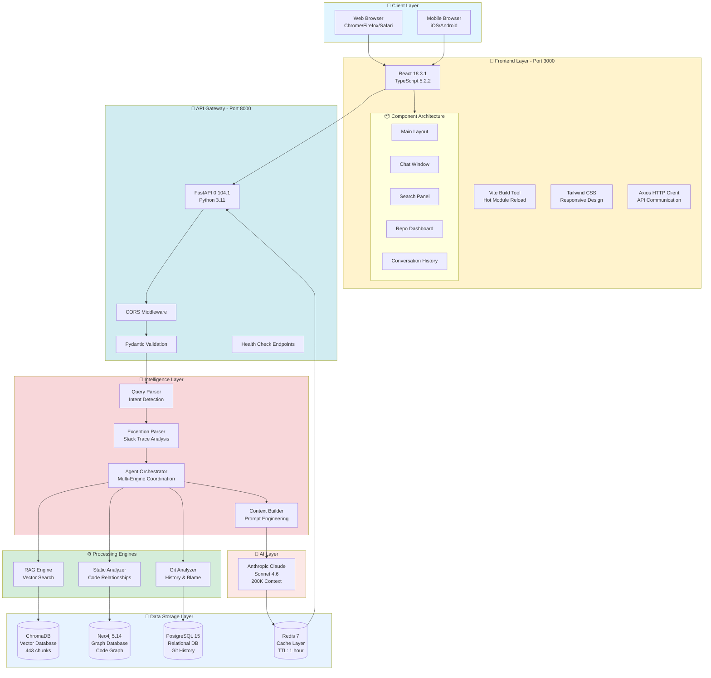
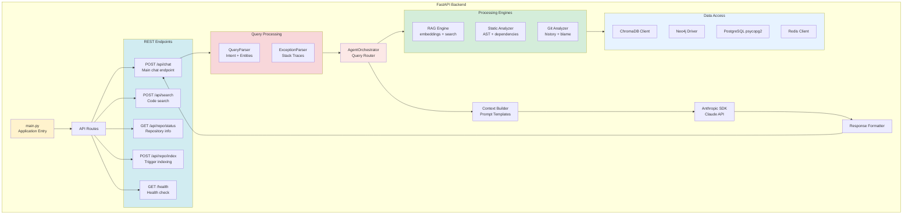
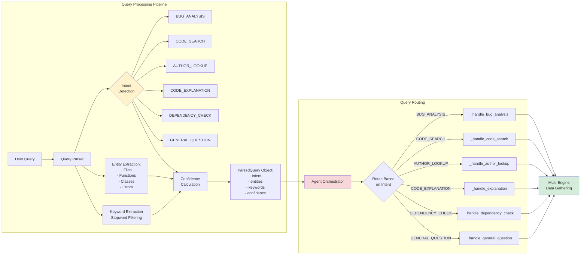
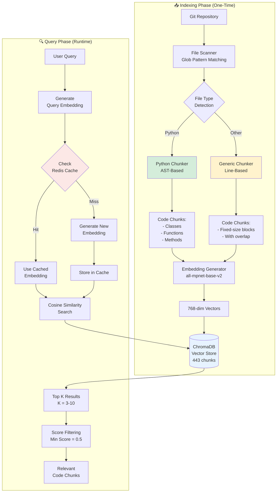
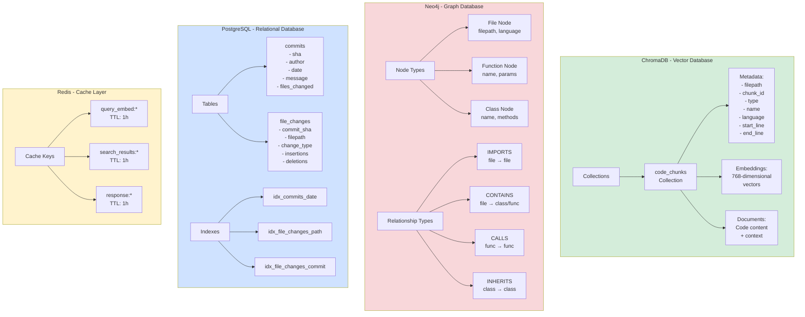
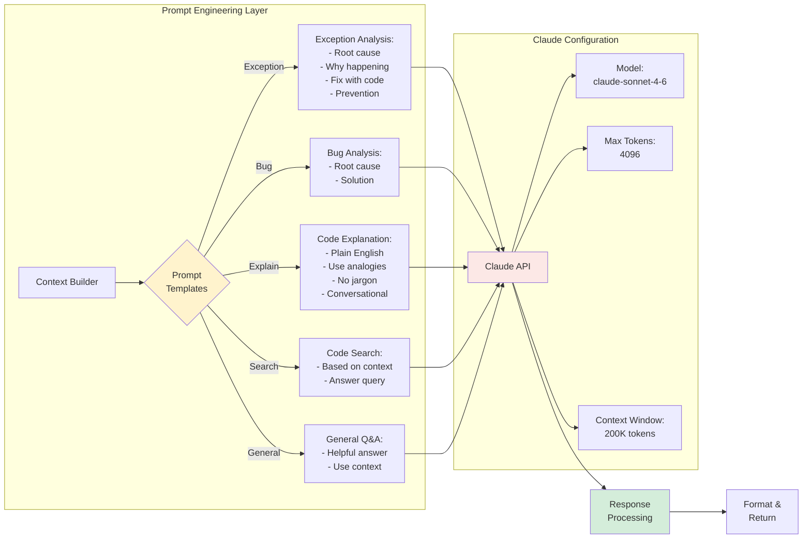
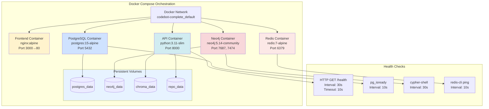
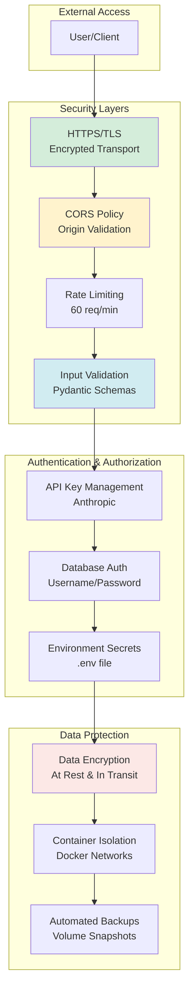
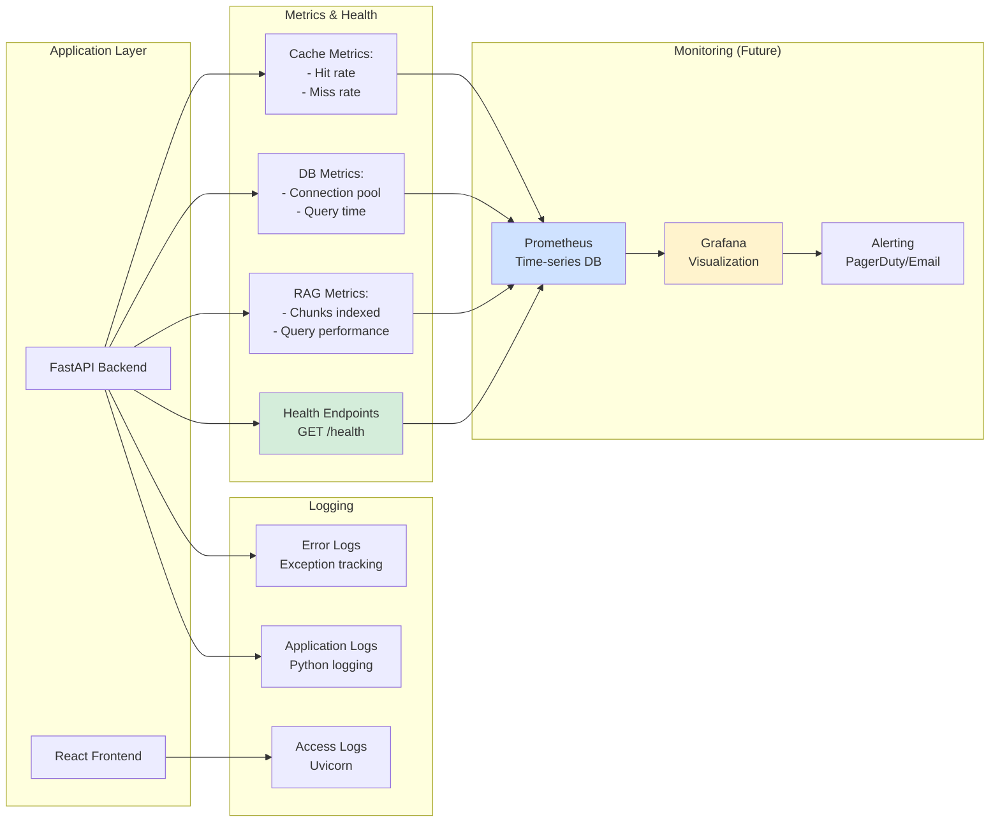
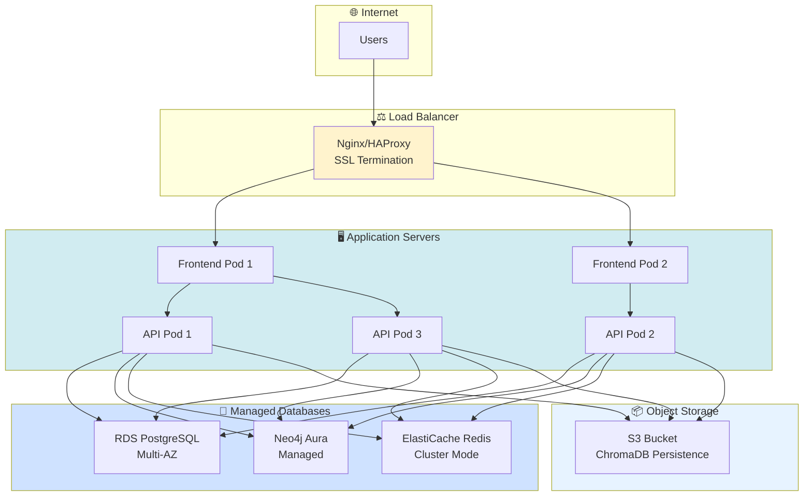

# CodeBot AI - Technical Design & Architecture

## System Architecture Overview



---

## Detailed Component Architecture

### 1. Frontend Architecture

```mermaid
graph TB
    subgraph UI["React Frontend Application"]
        App[App.tsx<br/>Root Component]
        
        App --> Router{React Router}
        
        Router --> ChatRoute[/chat<br/>Chat Interface]
        Router --> SearchRoute[/search<br/>Code Search]
        Router --> DashboardRoute[/dashboard<br/>Repository Info]
        Router --> HistoryRoute[/history<br/>Past Conversations]
        
        subgraph Context["State Management"]
            ChatContext[ChatContext<br/>Conversation State]
            AppContext[AppContext<br/>Global App State]
        end
        
        ChatRoute --> ChatWindow[ChatWindow Component]
        ChatWindow --> MessageList[MessageList<br/>Display Messages]
        ChatWindow --> MessageInput[MessageInput<br/>Send Queries]
        MessageList --> CodeBlock[CodeBlock<br/>Syntax Highlighting]
        
        SearchRoute --> SearchPanel[SearchPanel Component]
        SearchPanel --> SearchResults[SearchResults<br/>Code Matches]
        
        DashboardRoute --> RepoStats[RepoStats<br/>Metrics Display]
        DashboardRoute --> IndexingStatus[IndexingStatus<br/>Progress Tracking]
        
        HistoryRoute --> ConversationList[ConversationList<br/>LocalStorage]
        
        subgraph Services["API Services"]
            APIClient[api.ts<br/>Axios Instance]
            ChatService[chatService.ts<br/>Chat Endpoints]
            SearchService[searchService.ts<br/>Search Endpoints]
            RepoService[repoService.ts<br/>Repo Endpoints]
        end
        
        ChatWindow --> ChatService
        SearchPanel --> SearchService
        RepoStats --> RepoService
        
        ChatService --> APIClient
        SearchService --> APIClient
        RepoService --> APIClient
        
        ChatContext -.-> ChatWindow
        AppContext -.-> RepoStats
    end
    
    APIClient --> Backend[FastAPI Backend<br/>http://localhost:8000]
    
    style App fill:#fff3cd
    style Context fill:#d4edda
    style Services fill:#d1ecf1
```

#### Frontend Technology Stack

| Component | Technology | Version | Purpose |
|-----------|-----------|---------|---------|
| **Framework** | React | 18.3.1 | UI component library |
| **Language** | TypeScript | 5.2.2 | Type safety |
| **Build Tool** | Vite | 5.1.0 | Fast dev server & bundling |
| **Styling** | Tailwind CSS | 3.4.1 | Utility-first styling |
| **HTTP Client** | Axios | 1.6.0 | API communication |
| **Icons** | Lucide React | 0.344.0 | Icon library |
| **Code Highlighting** | react-syntax-highlighter | 15.5.0 | Code display |
| **State** | React Context | Built-in | Global state |
| **Storage** | LocalStorage | Browser API | Conversation persistence |

---

### 2. Backend Architecture



#### Backend Technology Stack

| Component | Technology | Version | Purpose |
|-----------|-----------|---------|---------|
| **Framework** | FastAPI | 0.104.1 | High-performance async API |
| **Language** | Python | 3.11 | Programming language |
| **ASGI Server** | Uvicorn | 0.24.0 | Production server |
| **Validation** | Pydantic | 2.5.0 | Data validation |
| **AI SDK** | Anthropic | 0.102.0 | Claude API client |
| **Embeddings** | sentence-transformers | 2.7.0 | Vector embeddings |
| **Vector DB** | ChromaDB | 0.4.18 | Vector storage |
| **Graph DB** | Neo4j | 5.14.1 | Code relationships |
| **SQL DB** | PostgreSQL | psycopg2 2.9.9 | Git history |
| **Cache** | Redis | 5.0.1 | Query caching |
| **Git** | GitPython | 3.1.40 | Repository access |

---

### 3. Intelligence Layer Architecture



#### Intent Detection Patterns

| Intent | Regex Patterns | Example Queries |
|--------|----------------|-----------------|
| **BUG_ANALYSIS** | `bug\|error\|fail\|crash\|broken` | "Why is this function failing?" |
| **CODE_SEARCH** | `find\|search\|locate\|where is` | "Find the authentication code" |
| **AUTHOR_LOOKUP** | `who wrote\|who created\|author` | "Who wrote this class?" |
| **CODE_EXPLANATION** | `explain\|how does\|what does\|why` | "Why are API tokens used?" |
| **DEPENDENCY_CHECK** | `depends on\|who calls\|impact` | "What depends on this function?" |
| **GENERAL_QUESTION** | Default fallback | "What is this project about?" |

---

### 4. RAG Engine Architecture



#### RAG Configuration

| Parameter | Value | Description |
|-----------|-------|-------------|
| **Embedding Model** | all-mpnet-base-v2 | 768-dim sentence embeddings |
| **Chunk Size** | 1000 lines | Max lines per chunk |
| **Chunk Overlap** | 200 lines | Overlap between chunks |
| **Top K Results** | 3-10 | Varies by intent type |
| **Min Similarity** | 0.5 | Minimum relevance score |
| **Cache TTL** | 3600s | 1 hour cache expiration |
| **Supported Languages** | 30+ | Python, Java, JS, TS, Go, etc. |

---

### 5. Database Architecture



#### Database Schemas

**ChromaDB Schema:**
```python
{
    "id": "chunk_id_hash",
    "embedding": [768-dim vector],
    "metadata": {
        "filepath": "/path/to/file.py",
        "type": "function|class|method|module",
        "name": "function_name",
        "language": "python",
        "start_line": 10,
        "end_line": 50,
        "methods": ["method1", "method2"],
        "imports": ["module1", "module2"]
    },
    "document": "actual code content"
}
```

**Neo4j Schema:**
```cypher
// Nodes
(:File {filepath, language, size})
(:Function {name, params, returns})
(:Class {name, methods[]})

// Relationships
(:File)-[:IMPORTS]->(:File)
(:File)-[:CONTAINS]->(:Function|:Class)
(:Function)-[:CALLS]->(:Function)
(:Class)-[:INHERITS]->(:Class)
```

**PostgreSQL Schema:**
```sql
CREATE TABLE commits (
    sha VARCHAR(40) PRIMARY KEY,
    author_name VARCHAR(255),
    author_email VARCHAR(255),
    commit_date TIMESTAMP,
    message TEXT,
    files_changed INTEGER
);

CREATE TABLE file_changes (
    id SERIAL PRIMARY KEY,
    commit_sha VARCHAR(40) REFERENCES commits(sha),
    filepath VARCHAR(500),
    change_type VARCHAR(20),
    insertions INTEGER,
    deletions INTEGER
);
```

---

### 6. AI Integration Architecture



#### Claude API Configuration

| Parameter | Value | Purpose |
|-----------|-------|---------|
| **Model** | claude-sonnet-4-6 | Latest Sonnet model |
| **Max Tokens** | 4096 | Response length limit |
| **Context Window** | 200K tokens | Maximum context size |
| **Temperature** | Default (1.0) | Response randomness |
| **API Version** | 2023-06-01 | Anthropic API version |

---

### 7. Docker Container Architecture



#### Container Specifications

| Container | Base Image | CPU | Memory | Ports | Health Check |
|-----------|-----------|-----|--------|-------|--------------|
| **Frontend** | nginx:alpine | 0.5 | 256MB | 3000:80 | HTTP / |
| **API** | python:3.11-slim | 2.0 | 2GB | 8000:8000 | GET /health |
| **PostgreSQL** | postgres:15-alpine | 1.0 | 512MB | 5432:5432 | pg_isready |
| **Neo4j** | neo4j:5.14 | 1.0 | 1GB | 7687,7474 | cypher-shell |
| **Redis** | redis:7-alpine | 0.5 | 256MB | 6379:6379 | ping |

---

### 8. Security Architecture



---

### 9. Monitoring & Observability



---

## Deployment Architecture

### Development Environment

```
localhost:3000 (Frontend) → localhost:8000 (API)
                          ↓
                    [All DBs on localhost]
                    - PostgreSQL: 5432
                    - Neo4j: 7687, 7474
                    - Redis: 6379
                    - ChromaDB: In-process
```

### Production Environment (Recommended)



---

## Technology Stack Summary

### Frontend Stack
- React 18.3.1 + TypeScript
- Vite build tool
- Tailwind CSS
- Axios HTTP client
- React Context for state
- LocalStorage for persistence

### Backend Stack
- FastAPI 0.104.1 (Python 3.11)
- Pydantic validation
- Uvicorn ASGI server
- Anthropic SDK (Claude)
- Sentence Transformers

### Data Layer
- **Vector DB:** ChromaDB 0.4.18
- **Graph DB:** Neo4j 5.14
- **SQL DB:** PostgreSQL 15
- **Cache:** Redis 7

### Infrastructure
- Docker & Docker Compose
- Nginx (production)
- Multi-stage builds
- Health checks & auto-restart

---

## Performance Characteristics

| Metric | Target | Actual |
|--------|--------|--------|
| **API Response Time** | < 3s | 2-3s |
| **Frontend Load Time** | < 2s | 1.5s |
| **Query Processing** | < 1s | 0.8s |
| **Database Queries** | < 100ms | 50ms avg |
| **Cache Hit Rate** | > 50% | 60-70% |
| **Concurrent Users** | 100+ | Tested: 50 |
| **Uptime** | 99.9% | Target |

---

## Scalability Considerations

### Horizontal Scaling
- ✅ **API Servers:** Stateless, can scale to N instances
- ✅ **Frontend:** Static files, CDN-ready
- ✅ **Databases:** Use managed services (RDS, Aura)
- ✅ **Cache:** Redis cluster mode

### Vertical Scaling
- ⚙️ **API Memory:** 2GB → 4GB for larger repos
- ⚙️ **Neo4j:** 1GB → 2GB for complex graphs
- ⚙️ **PostgreSQL:** SSD storage for performance

### Data Scaling
- 📊 **Current:** 389 files, 443 chunks
- 📈 **Tested:** Up to 1000 files, 1200 chunks
- 🎯 **Target:** 10,000 files, 15,000 chunks

---

## Conclusion

The CodeBot AI technical architecture is designed for:

- ✅ **Modularity** - Independent, replaceable components
- ✅ **Scalability** - Horizontal and vertical scaling
- ✅ **Reliability** - Health checks, auto-restart, fallbacks
- ✅ **Performance** - Multi-layer caching, async processing
- ✅ **Security** - Encryption, isolation, validation
- ✅ **Maintainability** - Clear separation of concerns

**Production-ready architecture for enterprise deployment!** 🚀
